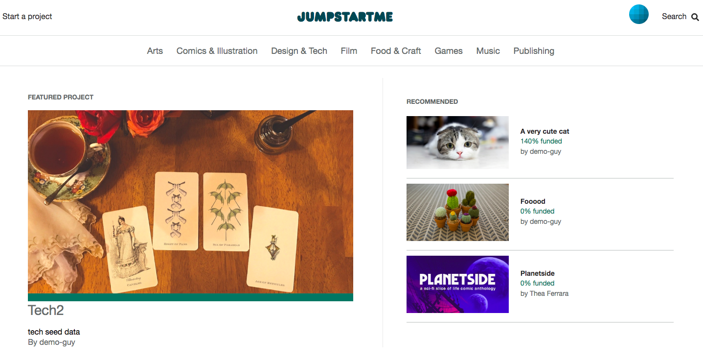

# JumpStartMe

JumpStartMe is a web application inspired by Kickstarter.

[Visit the Live JumpStartMe App here](https://jumpstartme.herokuapp.com/#/)

<p>
    
</p>
---

## Features

-   User Authentication
-   Home Page
    -   Featured Project
    -   Recommended Projects
    -   Search Projects
    -   Browse Project categories
-   Start a project
    -   Create a project with a funding goal, rewards, a deadline, etc. just like on Kickstarter!

## Technology Used

# Ruby on Rails (backend)

```ruby
  # /app/controllers/api/search_controller.rb

  class Api::SearchController < ApplicationController

    def show
      searchParam = params[:id]
      @projects = Project.where("name ILIKE ?", "%#{searchParam}%")
      render 'api/search/show'
    end

  end
```

#ActiveRecord
#ActiveStorage (AWS)
#PostgreSQL
#User Authentication
#React/Redux (frontend)
#jQuery
#DOM Manipulation - ES6
