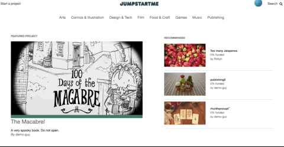
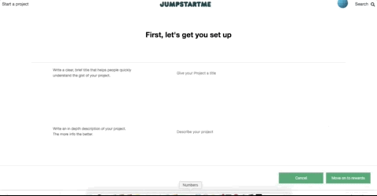

# JumpStartMe

JumpStartMe is a web application inspired by Kickstarter.

[Visit the Live JumpStartMe App here](https://jumpstartme.herokuapp.com/#/)

<p>
    
</p>
---

## Features

-   User Authentication
-   Create a new user
-   Login
-   Home Page
    -   Featured Project
    -   Recommended Projects
    -   Browse Project categories
-   Search Projects

    This is the backend of the search feature. The search term is passed directly into the path and ActiveRecord is used to search for similar terms.

      <p></p>

    ```ruby
      # /app/controllers/api/search_controller.rb

      class Api::SearchController < ApplicationController

        def show
          searchParam = params[:id]
          @projects = Project.where("name ILIKE ?", "%#{searchParam}%")
          render 'api/search/show'
        end

      end
    ```

    On the frontend, search is a class component, utilizing props such as whether search is currently active to decide whether to render the ul containing search results.

    ```javascript
                <div className="search-bar">
                <form onSubmit={this.handleSubmit}>
                    <div className="seach-div">
                        <input
                            className="search-input"
                            type="text"
                            value={this.state.query}
                            placeholder="search for a project by name"
                            onChange={this.edit("query")}
                        />
                        <button
                            id="close-search"
                            type="button"
                            onClick={this.props.toggleSearch}
                        >
                            X
                        </button>
                    </div>
                </form>
                <div
                    className={this.props.searchList ? "search-list" : "hidden"}
                >
                    <ul className="search-list-ul">{projects}</ul>
                </div>
            </div>
        );
    ```

-   Start a project

    -   Create a project with a funding goal, rewards, a deadline, etc. just like on Kickstarter!
    -   Also includes descriptive text, location, and an image representing the project

    <p></p>

-   Fund a project
    -   Can contribute to unlock project rewards

## Technologies Used

-   AWS
-   AWS is used for storing images associated with projects. This avoids storing references to image urls that could eventually become broken links, or worse yet saving large image files in the database.

-   PostgreSQL

-   React/Redux (frontend)

-   jQuery

-   ES6 JavaScript

-   Ruby on Rails (backend)
